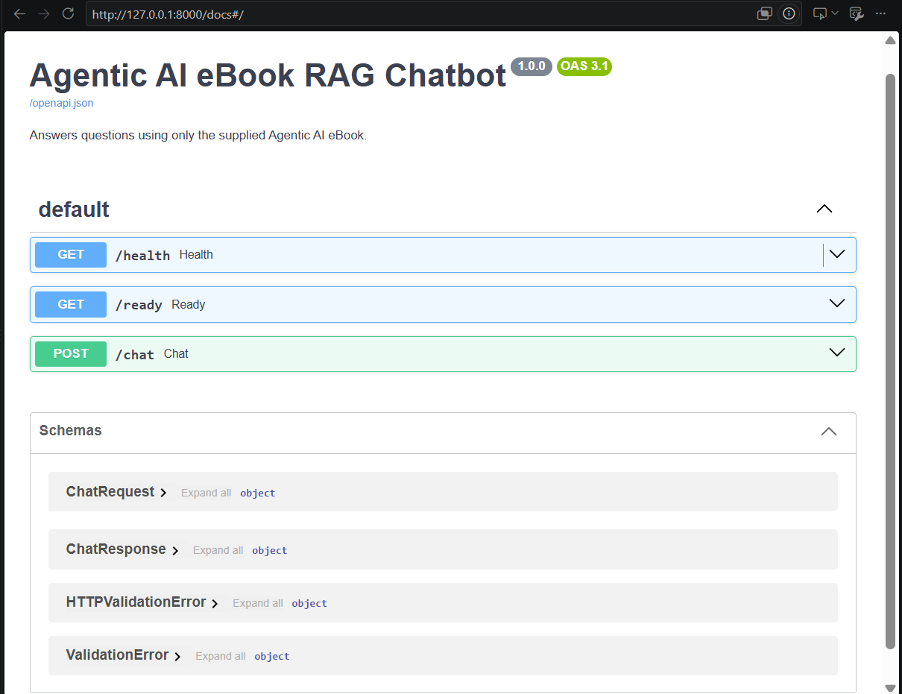
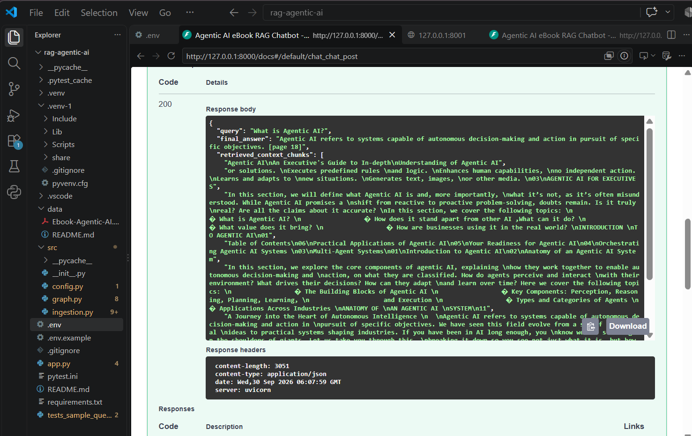

# Agentic AI eBook RAG Chatbot

FastAPI question answering grounded only in the assignment's Agentic AI eBook PDF. LangGraph coordinates retrieval, generation, a groundedness grade, a bounded retry, and a refusal. Pinecone stores vectors generated locally with a Sentence Transformers model. By default, a local Hugging Face instruct model handles both generation and structured grounding assessment, so no OpenAI API credits are needed.

## Project layout

```text
rag-agentic-ai/
├── Images/
│   ├── Image-1.png
│   └── Image-2.png
├── data/Ebook-Agentic-AI.pdf     # Place the supplied PDF here; not bundled
├── src/
│   ├── __init__.py
│   ├── config.py
│   ├── graph.py
│   └── ingestion.py
├── app.py
├── requirements.txt
├── .env.example
├── tests_sample_queries.py
└── README.md
```

## Prerequisites and setup

Use Python 3.11–3.13 and a Pinecone API key. Local embeddings and the default local chat model do not require OpenAI credits; the instruct model downloads from Hugging Face on its first use. Create and activate a virtual environment from this project directory:

```powershell
py -3.12 -m venv .venv
.venv\Scripts\Activate.ps1
python -m pip install -r requirements.txt
Copy-Item .env.example .env
```

## Ingest the PDF

From the project directory:

```bash
python -m src.ingestion
```

Ingestion extracts pages with `pypdf`, stores the source filename and one-based page number in chunk metadata, splits with overlap, creates a cosine serverless Pinecone index if needed, checks an existing index's dimension, generates embeddings locally, and upserts deterministic IDs. The local model avoids OpenAI embedding charges; Pinecone has its own provider costs.

## Run the API

```bash
uvicorn app:app --host 0.0.0.0 --port 8000
```

`GET http://localhost:8000/health` is a process liveness check. Before asking questions, check `GET http://localhost:8000/ready`; it verifies the configured Pinecone index exists, is ready, has the configured embedding dimension, and contains vectors in the configured namespace. A not-ready knowledge base returns HTTP 503 with the exact issue and remedy rather than making every question look like an out-of-scope refusal.

```bash
curl -X POST http://localhost:8000/chat \
  -H "Content-Type: application/json" \
  -d '{"query":"What planning strategies does the eBook describe?"}'
```

Each response has this shape:

```json
{
  "query": "What planning strategies does the eBook describe?",
  "final_answer": "…",
  "retrieved_context_chunks": [
    "Retrieved text from the eBook..."
  ],
  "confidence_score": 0.91
}
```

`retrieved_context_chunks` is a list of text strings, matching the assignment's response contract. Source and one-based page metadata remain attached to chunks internally and are used for citations in the answer. The confidence score expresses the grader's confidence that all answer claims are supported by retrieved text. Empty retrieval or repeated unsupported drafts produce a fixed refusal and `confidence_score: 0.0`; retrieved evidence is still returned when present. The generator prompt prohibits outside knowledge and asks for page citations; the local grader must return valid structured JSON or the request fails rather than bypassing the grounding check.

## Architecture

1. `src/ingestion.py` extracts PDF pages, preserves source/page metadata through recursive splitting, initializes the Pinecone index, and indexes locally generated vectors.
2. `PineconeRetriever` embeds each query locally and retrieves the top `RETRIEVAL_K` chunks.
3. `src/graph.py` runs a LangGraph state machine: `retrieve` → `generate` → `grade`; ungrounded output loops to generation up to `MAX_GENERATION_ATTEMPTS`, then routes to `refuse`. No retrieved chunks route directly to refusal. `CHAT_PROVIDER=local` shares one local Hugging Face model for answer generation and grading; `CHAT_PROVIDER=openai` uses OpenAI for both.
4. `app.py` exposes the graph through FastAPI's `/chat` endpoint.

The retrieval, generator, and grader are injected interfaces. Tests use deterministic fakes and do not require credentials, network access, or paid API calls.

## Screenshots





## Troubleshooting empty retrieval

An empty retrieval still receives the safe eBook-only refusal; it never falls back to general knowledge. The `/ready` endpoint and chat response now distinguish an empty/unavailable index from a genuinely out-of-scope query:

1. From the `rag-agentic-ai` project directory, activate the configured virtual environment, confirm `data/Ebook-Agentic-AI.pdf` exists, and run **`python -m src.ingestion`**. Wait for its final `Indexed ...` message. Ingestion waits until Pinecone can fetch every upserted vector and prints the index, namespace, and visible count; a timeout fails explicitly rather than reporting a false success.
2. Check **`http://localhost:8000/ready`**. It must return HTTP 200 with `status: "ready"` and a nonzero `vector_count` before chat requests should be tested.
3. In `.env`, use the same `PINECONE_INDEX` and `PINECONE_NAMESPACE` for ingestion and API. `PINECONE_NAMESPACE` defaults to the empty/default namespace. If vectors were previously ingested into a named namespace, set that exact namespace and restart the API; otherwise re-run ingestion into the configured namespace.
4. Ensure `EMBEDDING_MODEL` and `EMBEDDING_DIMENSION` match the model/index used by the ingestion run. Re-ingest if either setting changed. The default local model is 384-dimensional, so an older index with a different dimension must not be reused.
5. If `/ready` is HTTP 503, use its `detail` to distinguish an absent index, an index still starting, a dimension mismatch, zero vectors, or a namespace mismatch. If ingestion errors or Pinecone reports zero vectors after the upsert, resolve that before asking questions.

For Windows, the exact ingestion command from the project root is:

```powershell
.\.venv\Scripts\Activate.ps1
python -m src.ingestion
```

The app now waits for a newly created Pinecone index to become ready before upserting, waits for the upserted IDs to be fetchable in that namespace, checks namespace vector counts before constructing the live retriever, rechecks empty search results, and accepts integral page metadata represented as either numbers or numeric strings. A Pinecone match with missing/invalid page metadata raises a clear re-indexing error instead of being silently discarded. A populated ready index may still correctly refuse questions unsupported by retrieved eBook text.

## OpenAI quota errors

If the log contains `429 insufficient_quota` or `credit_balance_exhausted`, retrieval has already succeeded; the failure occurred during OpenAI generation/grading, not Hugging Face embeddings. The no-API-credit setup uses `CHAT_PROVIDER=local` with `LOCAL_CHAT_MODEL=Qwen/Qwen2.5-0.5B-Instruct` by default. The smaller model downloads on first chat use and should run more quickly on a CPU. Alternatively, add API billing credits to the OpenAI project tied to the key, set `CHAT_PROVIDER=openai`, and restart the server. A ChatGPT subscription is separate from OpenAI API billing.

## Sample queries and tests

`tests_sample_queries.py` contains six representative eBook queries plus mocked behavior tests for grounded answers, retry, empty-context refusal, and final refusal. Run:

```bash
pytest -q
```

## Deployment notes

Deploy behind an HTTPS reverse proxy or managed ingress. Provide API keys through the deployment platform's secret manager rather than committing `.env`; provision a persistent/managed Pinecone index and run ingestion as a separate one-off job before serving traffic. Set `PDF_PATH`, `CHAT_PROVIDER`, model names, Pinecone region, retrieval count, and retry limit in the service environment. For local-model deployments, provision enough memory/disk and allow model downloads or bake the model cache into the image. Add authentication and rate limiting at the ingress for public deployments.
